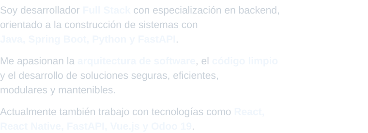

## Sobre mí

 

## Stack tecnológico

 

<table width="1000" align="center">

<tr>

<td width="500" align="center" valign="top">

<h3>Backend</h3>

 

  

  
  
  
  

  

</td>

<td width="500" align="center" valign="top">

<h3>Frontend</h3>

 

  

  
  
  
  

  

</td>

</tr>

<tr>

<td width="500" align="center" valign="top">

<h3>Datos</h3>

 

  

  
  
  

  

</td>

<td width="500" align="center" valign="top">

<h3>Infraestructura y calidad</h3>

 

  

  
  
  
  

  

</td>

</tr>

</table>

 

## Contacto

 

